# School_District_Analysis
## Overview of Analysis
- Maria has came to us with the need for help in an analysis she is doing for the school District. There has been some suspicion of cheating or dishonesty among the 9th graders in Thomas High School. Due to this suspicion Maria has ask us to delete the THS 9th graders from the analysis to ensure that she is providing accurate data to the district when she presents her findings. Along with Pandas, we will be using various python liberties to aid Maria in this project. 

### How is the district summary affected?

- As you can see below there is minimal changes from the district summary prior to dropping THS 9th grade math and reading scores. Some of the changes you see here include 
1. The average math score for the district dropped .1 
2. The reading score stayed the same but the reading passing percentage dropped by .3% 
3. The Percent of students passing math dropped by .2 percent and 
4. The overall passing percentage dropped by .1 percent. 

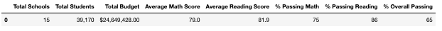
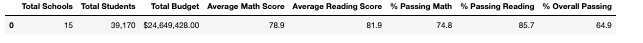

### How is the school summary affected?

- The only change to the school summary was on the THomas High School averages and percentages for passing. Below you will see that in the third to last line. 

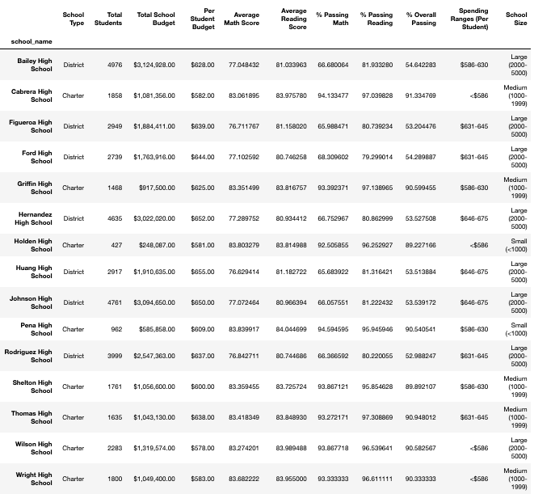
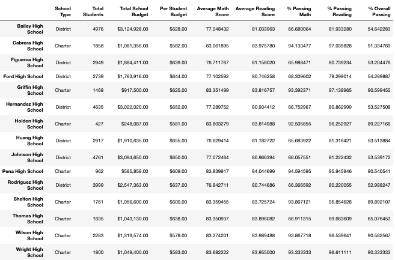

### How does replacing the 9th-grade scores affect the following:

#### Math Scores by grade

- The only change to Scores by grade is that in the column for 9th grade for THS it will show nan

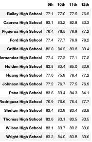
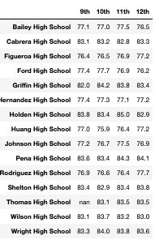

#### Reading Scores by grade

- The same thing as the math scores happened with the reading scores

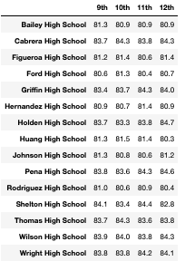
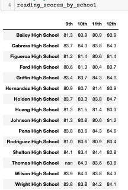

#### Scores by school spending

- The change is very minimal to scores by school spending. In fact, if I used the formatted version of this code it would show no difference in the outcome. In order for there to be a difference I would have to use the unformatted version. In this version below you will see that the change from the avg math score was lower by only .0017 point with is negligable. The reading went up by .012 points. The Math adn reading passing percentage went down by .022 and .072 % respectively. The overall passing percent went down by .08%. These changes all happened within the $631-$645 spending range, the rest of the ranges stayed identical because THS wasn't part of those ranges. 

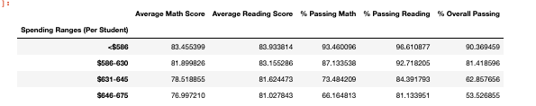
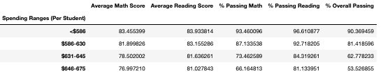

#### Scores by School Size

- THS was part of the Medium School Size so that is the only scores that change. Even then, the difference can only be noted if I use the unformatter code for this analysis otherwise the scores remain the same. Avg math scores dropped .01, avg reading up .1, pass math % down 0.017%, passsing reading % down .06% and overall passing % down .07%.

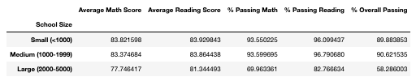
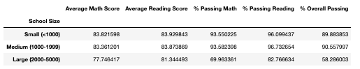

#### Scores by school type

- Like the last two points the difference is only noticable if we dont format the score's decimals. Below we see that there are minor changes to the Charter school type because THS belong to that catergory. Math Schores down .01, reading scores up .01, passing math % down .01%, passing reading % down .03% and overall passing % down .04%. 

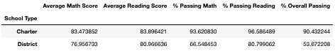

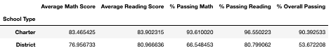

### Summary 

- In summary the changes found from dropping the 9th grade scores from Thomas High School were very minimal. Above under each category you will see a small summary of each finidng. 
